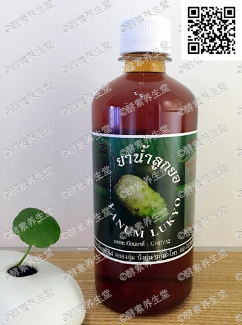

##诺丽果酵素(2#)

####成分
>成熟的诺丽果配合泰国草药发酵
而成。

####功能
>产品中含有的氨基酸能有效补充 钙元素,促进消化系统改善睡眠。对年 老体弱易疲劳,用脑过度、胀气、呕吐、 消化不良有很好的帮助,对提高身体免 疫系统,促进血液循环,加强和恢复细 胞组织,特别对更年期的骨质疏松有很 好的预防作用。

####用法
>饭前2匙兑蜂蜜水 ,不可睡前服用, 会影响睡眠。开盖后存放冰箱。

####容量
>480ml/瓶

####原产地
>泰国净土村 