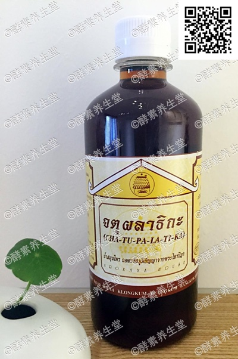

##大肠排毒酵素(4#)

####成分
>泰国四种草药配制而成

####功能
>主要用于大肠排毒。减少体内多 余脂肪,抗氧化剂高,减少自由基有助 于延缓衰老,让皮肤健康光滑。增加免 疫系统降低患癌风险,有效激活血球细 胞,促进血液循环,对胆固醇高,便秘 和排毒排油、痔疮、痘痘有疗效,比较
适用于药物过敏和借助药物保健的人群,
开盖如表面有一层薄白膜属正常现象。

####用法
>饭前2匙兑蜂蜜水 ,不可睡前服 用,会影响睡眠。开盖后存放冰箱。

####容量
>480ml/瓶

####原产地
>泰国净土村 