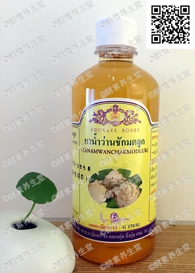

##保养调理酵素(5#)

####成分
>泰国北部草药

####功能
>能有效修复雄性和雌性的内部激 素。对女性的卵巢保养护理,调理月经 不调、白带多、痛经问题,帮助分娩后 的羊水排净,促进乳汁分泌。缓解更年 期引起的骨质流失,缩小囊肿、肿瘤肿 块,对慢性膀胱炎和哮喘、痔疮有帮助。 对男性问题可以缓解前列腺炎,降低胆 固醇,强壮精子活力,帮助有生育需求 的男女调理身体,孕妇禁服。

####用法
>饭前2匙兑蜂蜜水 ,不可睡前服 用,会影响睡眠。开盖后存放冰箱。

####容量
>480ml/瓶

####原产地
>泰国净土村 