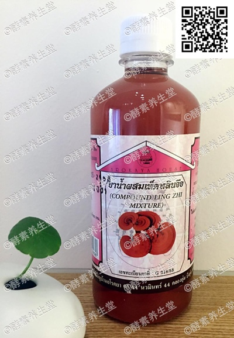

##灵芝黑人参酵素(7#)

####成分
>野生灵芝、泰国黑人参和泰国草
药配制发酵。

####功能
>对身体虚弱有滋补作用。平衡血压,促进血液循环,对半身不遂、瘫痪或手脚麻木病人加以辅助治疗。清理血管壁,减少垃圾堆积,使血液畅通;活跃脑细胞生长,帮助治癌防癌,男女适用。

####用法
>早晚饭前各服一次,每次半匙调 配一杯蜂蜜水。不可睡前服用,会影响 睡眠。

####容量
>480ml/瓶

####原产地
>泰国净土村 