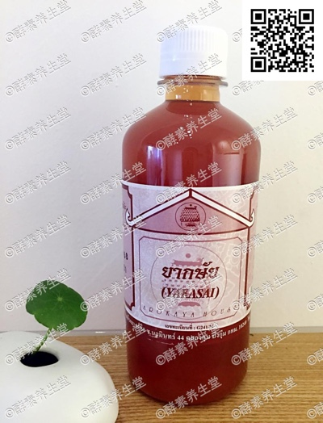

##通经络酵素(12#)

####成分
>16种泰国草药配制

####功能
>针对筋络问题,帮助强化疏通筋 络,增加人体筋络的柔韧度。缓解背部 酸痛,腰肌劳损疼痛不适,促进血液循 环,降低血压,防止静脉血栓的形成。 减少胆固醇,帮助减肥,对痛风、偏头 痛,瘫痪有治疗保健作用。

####用法
>饭前2匙兑蜂蜜水 ,不可睡前服 用,会影响睡眠。开盖后存放冰箱。

####容量
>480ml/瓶

####原产地
>泰国净土村