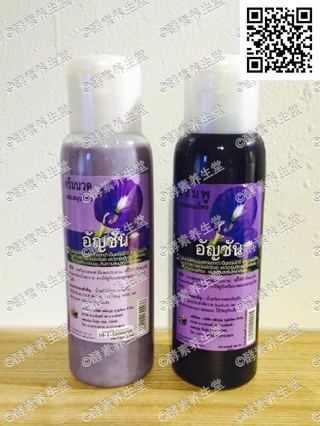

##洛神花洗发护发素(28#)

####成分
>甘蔗渣的粉末

####功能
>针对于化学污染。环境，如汽车尾气的空气污染，工厂车间等工作环境的影响，特别对于吸烟喝酒者有解毒和保护作用，内服可以清理身体的内化学毒素。外用，如身体接触化学制剂，可浸泡手脚或身体使之化解，可用于浸泡食用化学农药种植的果蔬，帮助去除化学毒素，对特别需要排出身体化学毒素的服用期间，不能吃其他药物，以免影响毒素的排除。

####用法
>饭前2匙兑蜂蜜水，不可睡前服用，会影响睡眠。开盖后存放冰箱。

####容量
>480ml/瓶

####原产地
>泰国净土村 