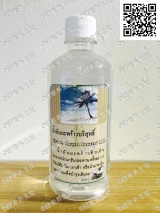

##天然椰子油(101#)

####成分
>天然椰子

####功能
>1.美容护肤:可用于卸妆,清洁,外敷可保护 皮肤不受紫外线伤害。 2.护发:可防止头皮屑、保护头皮,预防灰 发和秃头的提早发生。 3.排毒养颜:强大抗菌功能的各种脂肪酸会 有效地将身体内的有害病毒杀死,将累积的 毒素逐渐排出体外。 4.护齿:椰子油含丰富的月桂酸是天然的抗 生素,刷完牙后,喝一口椰子油10-15CC含 在口中1-2分钟后,可吞入腹中或吐出,可 以杀死口腔细菌达到美白牙齿保牙龈健康的效果。

####容量
>480ml/瓶

####原产地
>泰国净土村